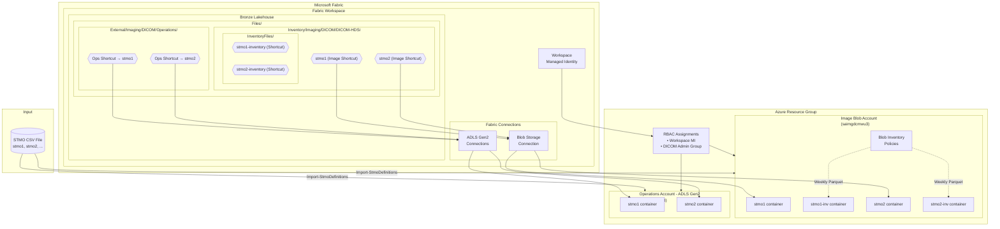
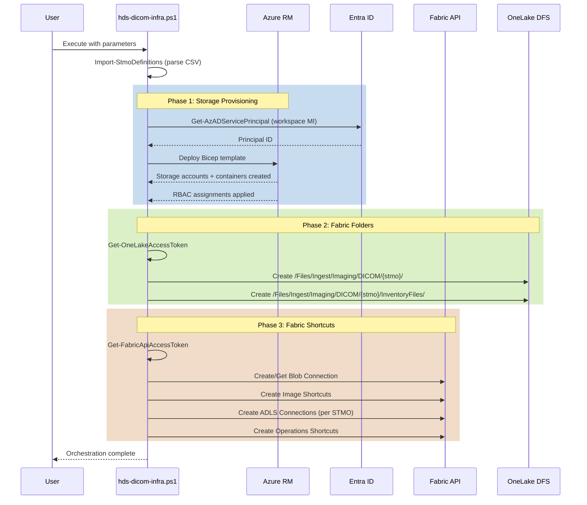

# HDS DICOM Infrastructure Automation

This repository contains a PowerShell automation script and supporting Bicep templates that provision Azure storage resources and configure Microsoft Fabric lakehouse integration for DICOM imaging workloads.

## Overview

The solution orchestrates five responsibilities:

1. **Azure authentication** – Verifies an interactive Azure session is already established and halts with guidance if not.

2. **Shared storage provisioning** – Deploys two storage accounts using the `infra/storageAccounts.bicep` template:
   - **Image Blob Account** (`sa{imgdcm}{suffix}`) – Standard blob storage for DICOM image ingestion. One container per STMO plus corresponding inventory containers with `-inv` suffix.
   - **Image Operations Account** (`sa{imgops}{suffix}`) – ADLS Gen2 (hierarchical namespace enabled) for inventory output and downstream processing. One container per STMO.
   - **Reuse existing accounts** – Optionally reuse pre-provisioned storage accounts with `-ReuseStorageAccounts` switch. The script validates accounts exist, creates missing containers, configures inventory policies, assigns RBAC roles, and applies ADLS Gen2 ACLs with recursive cascading.

3. **Blob inventory governance** – Each STMO receives a dedicated blob inventory policy on the image blob account that scans block blobs weekly, captures all available metadata fields in Apache Parquet format, and writes results to the associated `-inv` container.

4. **Trusted workspace identity** – Automatically assigns the Fabric workspace's managed identity and a DICOM administrators security group the Storage Blob Data Contributor role on each provisioned storage account.

5. **Fabric lakehouse integration** – Creates standardized folder structures and shortcuts in the target Fabric lakehouse:
   - **Folders**: `/Files/Inventory/Imaging/DICOM/DICOM-HDS/` and `/Files/Inventory/Imaging/DICOM/DICOM-HDS/InventoryFiles/`
   - **Image shortcuts**: Links blob containers to the lakehouse at `/Files/Inventory/Imaging/DICOM/DICOM-HDS/{stmo}`
   - **Inventory shortcuts**: Links inventory containers (`-inv`) at `/Files/Inventory/Imaging/DICOM/DICOM-HDS/InventoryFiles/{stmo}-inventory`
   - **Operations shortcuts**: Links ADLS Gen2 containers for processing via `/Files/External/Imaging/DICOM/Operations/`
   - **Connections**: Creates workspace-scoped Fabric connections using workspace managed identity authentication
   - **Conflict resolution**: Handles shortcut conflicts with interactive prompts (auto-selects "Keep" after 10 seconds of no input)

## Architecture

### System Diagram



### Data Flow



### Storage Account Naming

Storage accounts are named using the pattern: `{prefix}{coreName}{suffix}`

Example with defaults:
- Image blob account: `saimgdcmwu3`
- Operations account: `saimgopswu3`

Names are sanitized (lowercase, alphanumeric only) and truncated to 24 characters per Azure requirements.

### Container Structure

For each STMO (e.g., "STMO 5" → sanitized to "stmo-5"):

**Image Blob Account:**
| Container | Purpose |
|-----------|---------|
| `stmo-5` | Primary container for DICOM images |
| `stmo-5-inv` | Inventory output container (Parquet files) |

**Operations Account (ADLS Gen2):**
| Container | Purpose |
|-----------|---------|
| `stmo-5` | Container for downstream processing and analytics |

### Lakehouse Structure

```
Files/
├── Inventory/
│   └── Imaging/
│       └── DICOM/
│           └── DICOM-HDS/
│               ├── stmo1/           [Image Shortcut → Blob Container stmo1]
│               ├── stmo2/           [Image Shortcut → Blob Container stmo2]
│               └── InventoryFiles/
│                   ├── stmo1-inventory/  [Shortcut → Blob Container stmo1-inv]
│                   └── stmo2-inventory/  [Shortcut → Blob Container stmo2-inv]
└── External/
    └── Imaging/
        └── DICOM/
            └── Operations/
                ├── stmo1/  [Shortcut → ADLS Gen2 Container]
                └── stmo2/  [Shortcut → ADLS Gen2 Container]
```

## Prerequisites

- PowerShell 7.2 or later
- Azure PowerShell modules `Az.Accounts` and `Az.Resources` (imported automatically when available)
- Run `Connect-AzAccount` before executing the script
- The current Azure context must target the tenant and subscription specified by the parameters
- Bicep CLI/runtime available (installed with the latest Az PowerShell module or separately)

### Required Permissions

| Category | Required Role / Permission | Scope |
|----------|----------------------------|-------|
| Azure RBAC | Owner **or** (Contributor + User Access Administrator) | Resource Group |
| Entra ID | Directory Readers **or** `Directory.Read.All` | Tenant |
| Fabric | Workspace Admin or Member | Target Workspace |
| Fabric API | `Connection.ReadWrite.All`, `Connection.Read.All` | Tenant (delegated auth) |

See [Required Permissions (Detailed)](#required-permissions-detailed) for complete details.

## CSV Format

The CSV file defines study locations (STMOs). Each row represents one study location that will receive:
- A blob container for image ingestion
- An inventory container (suffixed with `-inv`)
- A container in the operations storage account
- Lakehouse folders and shortcuts

**Required column** (one of): `STMO`, `study`, or `studyLocation`

Example:
```csv
STMO
STMO1
STMO2
STMO 5
STMO LONG NAME WITH SPACES 7
```

Study locations are sanitized to meet Azure Storage naming requirements:
- Converted to lowercase
- Spaces and special characters replaced with hyphens
- Consecutive hyphens collapsed
- Truncated to 63 characters maximum (container name limit)

## Usage

### Minimum parameters

```powershell
Connect-AzAccount

.\hds-dicom-infra.ps1 `
    -TenantId "<tenant-guid>" `
    -SubscriptionId "<subscription-guid>" `
    -location "westus3" `
    -ResourceGroupName "rg-hds-prod" `
    -FacilityCsvPath ".\data\stmos.csv" `
    -hdsWorkspaceName "DICOM-Integration" `
    -FabricWorkspaceId "<fabric-workspace-guid>" `
    -HdsBronzeLakehouse "<lakehouse-guid>" `
    -DicomAdmSecGrpId "<security-group-object-id>"
```

### Full example with all parameters

```powershell
Connect-AzAccount

.\hds-dicom-infra.ps1 `
    -FacilityCsvPath .\example-stmos.csv `
    -TenantId 8d038e6a-9b7d-4cb8-bbcf-e84dff156478 `
    -location westus3 `
    -SubscriptionId 9bbee190-dc61-4c58-ab47-1275cb04018f `
    -ResourceGroupName rg-DICOM `
    -hdsWorkspaceName DICOM-Integration `
    -PrefixName sa `
    -LocationSuffix wu3 `
    -ImageBlobAccountCoreName imgdcm `
    -ImageOperationsAccountCoreName imgops `
    -stoBicepTemplatePath '.\infra\storageAccounts.bicep' `
    -DeploymentName hds-storage-provisioning `
    -StorageAccountSkuName Standard_LRS `
    -StorageAccountKind StorageV2 `
    -FabricWorkspaceId 93acd72f-a23e-4b93-968d-c139600891e7 `
    -HdsBronzeLakehouse 74f52728-9f52-456f-aeb0-a9e250371087 `
    -DicomAdmSecGrpId 425d706b-afd7-4044-8110-f5fc4663f5bc `
    -GlobalTags @{ Environment = 'prod'; Workstream = 'dicom' } `
    -Debug
```

### Partial execution

**Azure storage only** (skip Fabric operations):

```powershell
.\hds-dicom-infra.ps1 `
    -FacilityCsvPath .\example-stmos.csv `
    -TenantId "<tenant-guid>" `
    -SubscriptionId "<subscription-guid>" `
    -location westus3 `
    -ResourceGroupName rg-DICOM `
    -hdsWorkspaceName DICOM-Integration `
    -FabricWorkspaceId "<fabric-workspace-guid>" `
    -HdsBronzeLakehouse "<lakehouse-guid>" `
    -DicomAdmSecGrpId "<security-group-object-id>" `
    -SkipFabricFolders `
    -SkipFabricShortcuts
```

**Fabric operations only** (skip storage deployment):

```powershell
.\hds-dicom-infra.ps1 `
    -FacilityCsvPath .\example-stmos.csv `
    -TenantId "<tenant-guid>" `
    -SubscriptionId "<subscription-guid>" `
    -location westus3 `
    -ResourceGroupName rg-DICOM `
    -hdsWorkspaceName DICOM-Integration `
    -FabricWorkspaceId "<fabric-workspace-guid>" `
    -HdsBronzeLakehouse "<lakehouse-guid>" `
    -DicomAdmSecGrpId "<security-group-object-id>" `
    -SkipStorageDeployment
```

**Reuse existing storage accounts** (validates, configures containers, RBAC, and ACLs):

```powershell
.\hds-dicom-infra.ps1 `
    -FacilityCsvPath .\example-stmos.csv `
    -TenantId "<tenant-guid>" `
    -SubscriptionId "<subscription-guid>" `
    -location westus3 `
    -ResourceGroupName rg-DICOM `
    -hdsWorkspaceName DICOM-Integration `
    -FabricWorkspaceId "<fabric-workspace-guid>" `
    -HdsBronzeLakehouse "<lakehouse-guid>" `
    -DicomAdmSecGrpId "<security-group-object-id>" `
    -ReuseStorageAccounts `
    -ExistingBlobStorageAccountName "myexistingblobaccount" `
    -ExistingOperationsStorageAccountName "myexistingadlsaccount"
```

> **Note:** When using `-ReuseStorageAccounts` without specifying account names, the script will prompt interactively. The operations account **must** have Hierarchical Namespace (ADLS Gen2) enabled or the script will fail.

### Key Parameters

| Parameter | Description | Default |
|-----------|-------------|---------|
| `-TenantId` | Microsoft Entra tenant ID | *Required* |
| `-SubscriptionId` | Azure subscription ID | *Required* |
| `-location` | Azure region for resource deployment | *Required* |
| `-ResourceGroupName` | Target resource group name | *Required* |
| `-FacilityCsvPath` | Path to CSV file containing STMO definitions | *Required* |
| `-hdsWorkspaceName` | Display name of the Fabric workspace (used to resolve managed identity) | *Required* |
| `-FabricWorkspaceId` | GUID of the target Fabric workspace | *Required* |
| `-HdsBronzeLakehouse` | GUID of the target lakehouse | *Required* |
| `-DicomAdmSecGrpId` | Object ID of the DICOM administrators security group | *Required* |
| `-PrefixName` | Storage account name prefix | `sa` |
| `-LocationSuffix` | Storage account name suffix (typically region abbreviation) | `wu3` |
| `-ImageBlobAccountCoreName` | Core segment for blob storage account name | `imgdcm` |
| `-ImageOperationsAccountCoreName` | Core segment for operations storage account name | `imgops` |
| `-StorageAccountSkuName` | SKU for storage accounts | `Standard_LRS` |
| `-StorageAccountKind` | Storage account kind | `StorageV2` |
| `-GlobalTags` | Hashtable of tags applied to all storage accounts | `@{}` |
| `-SkipStorageDeployment` | Skip Azure storage account/container provisioning | `$false` |
| `-SkipFabricFolders` | Skip lakehouse folder creation | `$false` |
| `-SkipFabricShortcuts` | Skip Fabric connection and shortcut creation | `$false` |
| `-ReuseStorageAccounts` | Reuse pre-provisioned storage accounts instead of deploying new ones | `$false` |
| `-ExistingBlobStorageAccountName` | Name of existing blob storage account (used with `-ReuseStorageAccounts`) | – |
| `-ExistingOperationsStorageAccountName` | Name of existing ADLS Gen2 storage account (used with `-ReuseStorageAccounts`) | – |
| `-WhatIf` | Preview Bicep deployment without applying changes | – |
| `-Debug` | Enable verbose debug logging | – |

## File Structure

```
.
├── hds-dicom-infra.ps1                     # Main orchestration script
├── storage-access-trusted-workspace.ps1   # Troubleshooting helper (see below)
├── example-stmos.csv                       # Example STMO definitions
├── example-fmos-stmos.csv                  # Alternative example CSV
├── README.md
├── LICENSE                                 # MIT License
└── infra/
    ├── storageAccounts.bicep              # Main Bicep template
    └── modules/
        ├── containers.bicep               # Container and inventory policy module
        └── keyVault.bicep                 # Key Vault module (optional/future use)
```

## Required Permissions (Detailed)

### Azure RBAC

| Role | Scope | Purpose |
|------|-------|---------|
| **Contributor** | Resource Group | Deploy storage accounts, containers, and blob services |
| **User Access Administrator** | Resource Group | Create role assignments for workspace identity and admin group |

> **Tip:** The **Owner** role includes both permissions.

### Microsoft Entra ID

| Permission | Purpose |
|------------|---------|
| `Directory.Read.All` or **Directory Readers** | Resolve Fabric workspace managed identity by display name using `Get-AzADServicePrincipal` |

### Microsoft Fabric

| Role / Permission | Scope | Purpose |
|-------------------|-------|---------|
| **Workspace Admin** or **Member** | Target Workspace | Create connections, shortcuts, and directories |
| `Connection.ReadWrite.All` | Tenant (delegated) | Create Fabric connections |
| `Connection.Read.All` | Tenant (delegated) | Query existing connections |

### API Token Scopes

The script acquires delegated access tokens for the following resources:

| Resource | Purpose |
|----------|---------|
| `https://api.fabric.microsoft.com/.default` | Fabric management API calls (connections, shortcuts, metadata) |
| `https://storage.azure.com/.default` | OneLake directory operations via the DFS endpoint |

### Roles Assigned by the Script

These roles are created during deployment and do **not** need to be held by the executing user:

| Role | Assigned To | Scope |
|------|-------------|-------|
| **Storage Blob Data Contributor** | Fabric Workspace Managed Identity | Both storage accounts |
| **Storage Blob Data Contributor** | DICOM Admin Security Group | Both storage accounts |

## Troubleshooting

### Trusted Workspace Network Rule Script

The `storage-access-trusted-workspace.ps1` script is a standalone troubleshooting utility that adds a network rule to allow a specific Fabric workspace's managed identity access to a storage account. **This script is not part of the main workflow** but can be useful when:

- The main script's RBAC assignment succeeds but Fabric still cannot access storage due to network restrictions
- You need to manually configure trusted workspace access on an existing storage account
- Debugging connectivity issues between Fabric and Azure Storage

**Usage:**

```powershell
# Edit the script variables first, then run:
.\storage-access-trusted-workspace.ps1
```

**Script variables to configure:**

| Variable | Description |
|----------|-------------|
| `$resourceId` | Full ARM resource ID of the Fabric workspace |
| `$tenantId` | Microsoft Entra tenant ID |
| `$resourceGroupName` | Resource group containing the storage account |
| `$accountName` | Name of the storage account to configure |

This adds a resource instance rule using `Add-AzStorageAccountNetworkRule`, which grants the Fabric workspace's managed identity access through the storage account's firewall.

### Common Issues

**"Unable to locate a service principal named '...'"**
- Ensure the Fabric workspace has its managed identity enabled
- Verify the `-hdsWorkspaceName` parameter matches the exact display name in Entra ID

**Fabric connection creation fails**
- Verify delegated permissions `Connection.ReadWrite.All` are granted
- Check that the workspace managed identity has been assigned to the storage accounts

**OneLake directory creation returns 403**
- The storage token may have expired; re-run the script
- Verify the executing identity has Workspace Admin/Member role in Fabric

**Blob inventory not generating files**
- Inventory policies run on a weekly schedule; allow up to 24 hours after policy creation
- Verify the `-inv` containers exist and have the correct inventory policy attached

## References

- [Azure Storage account naming rules](https://learn.microsoft.com/azure/storage/common/storage-account-overview#storage-account-names)
- [OneLake REST API parity with ADLS](https://learn.microsoft.com/fabric/onelake/onelake-api-parity)
- [Fabric Connections API](https://learn.microsoft.com/rest/api/fabric/core/connections/create-connection)
- [Fabric Shortcuts API](https://learn.microsoft.com/rest/api/fabric/core/onelake-shortcuts)
- [Azure Blob Inventory](https://learn.microsoft.com/azure/storage/blobs/blob-inventory)
- [Trusted access to Azure Storage for Fabric](https://learn.microsoft.com/fabric/security/security-trusted-workspace-access)

---

## Changelog

All notable changes to this project will be documented in this section.

### [1.2.0] - 2025-12-09

#### Added
- **Reuse existing storage accounts** – New `-ReuseStorageAccounts` switch enables reusing pre-provisioned storage accounts instead of deploying new ones
- New parameters `-ExistingBlobStorageAccountName` and `-ExistingOperationsStorageAccountName` for specifying existing account names
- Interactive prompts for storage account names when `-ReuseStorageAccounts` is used without explicit account names
- Validation that existing operations storage account has Hierarchical Namespace (ADLS Gen2) enabled – script now fails if HNS is not enabled
- Automatic creation of missing containers on existing storage accounts
- Automatic configuration of missing blob inventory policy rules on existing accounts
- Automatic RBAC role assignment for workspace identity and DICOM admin group on existing accounts
- **ADLS Gen2 ACL cascading** – Recursive ACL application on operations containers for both workspace identity and DICOM admin security group
- New helper functions: `Test-StorageAccountExists`, `Get-StorageAccountContainers`, `New-MissingContainers`, `New-MissingRoleAssignment`, `Get-BlobInventoryPolicy`, `New-MissingInventoryPolicy`, `Set-AdlsContainerAcl`, `Confirm-ExistingStorageAccounts`

#### Changed
- Operations storage account now requires ADLS Gen2 (HNS enabled) – validation failure instead of warning
- Updated module requirements to include `Az.Storage` for container and ACL management

### [1.3.0] - 2025-12-23

#### Changed
- **Lakehouse folder structure**: Reorganized from `/Files/Ingest/Imaging/DICOM/{stmo}/` to `/Files/Inventory/Imaging/DICOM/DICOM-HDS/`
- **Image shortcuts**: Now placed directly at `/Files/Inventory/Imaging/DICOM/DICOM-HDS/{stmo}` (no nested folder per STMO)
- **Inventory shortcuts**: Moved to dedicated subfolder at `/Files/Inventory/Imaging/DICOM/DICOM-HDS/InventoryFiles/{stmo}-inventory`
- **Inventory shortcut targets**: Now use Azure Blob Storage (`azureBlobStorage`) instead of ADLS Gen2, pointing to the same blob storage account as image shortcuts with `-inv` container suffix

#### Added
- **Shortcut conflict resolution**: Interactive prompt when creating shortcuts that already exist with options:
  - `[K]` Keep existing shortcut and continue (default)
  - `[R]` Replace - delete existing and create new
  - `[A]` Abort - stop script execution
- **Auto-select timeout**: Conflict resolution prompts auto-select "Keep" after 10 seconds of no user input for automation-friendly execution
- **DICOM-HDS base folder**: Script now creates the `/Files/Inventory/Imaging/DICOM/DICOM-HDS` folder if it doesn't exist before creating shortcuts
- **Tenant-scoped connection lookup**: Checks for both workspace-scoped and tenant-scoped Fabric connections before creating new ones
- **409 conflict handling**: Gracefully handles `DuplicateConnectionName` errors by looking up existing connections
- **404 delete handling**: Treats 404 errors on shortcut deletion as success (shortcut already gone)
- **API propagation delay**: 10-second wait after shortcut deletion before retry to allow Fabric API to propagate changes

#### Fixed
- Fixed `singleSignOnType` from `ManagedIdentity` to `None` for ADLS connections (required for workspace identity auth)
- Fixed inventory shortcuts to use blob storage instead of ADLS Gen2 (inventory containers are on the blob storage account)

### [1.2.0] - 2025-12-XX

#### Added
- `-ReuseStorageAccounts` switch for using pre-provisioned storage accounts
- Storage account validation and container creation for reuse mode
- ADLS Gen2 ACL management with recursive cascading

#### Changed
- Updated module requirements to include `Az.Storage` for container and ACL management

### [1.1.0] - 2025-12-06

#### Changed
- Updated README documentation to accurately reflect actual script behavior
- Corrected architecture description from "per-facility" to "shared storage accounts with per-STMO containers"
- Fixed CSV column requirements documentation (now correctly shows `STMO`, `study`, or `studyLocation`)

#### Added
- Architecture diagrams (system overview and data flow sequence)
- Detailed container and lakehouse structure documentation
- Troubleshooting section with common issues and resolutions
- Documentation for `storage-access-trusted-workspace.ps1` helper script
- Comprehensive parameter reference table
- Changelog/version tracking

#### Removed
- Removed empty `create-fabric-lh-folders.ps1` placeholder script
- Removed incorrect references to `facilityLocation` CSV column

### [1.0.0] - 2025-11-XX

#### Added
- Initial release of HDS DICOM infrastructure automation
- PowerShell orchestration script (`hds-dicom-infra.ps1`)
- Bicep templates for storage account and container provisioning
- Support for blob inventory policies with Parquet output
- Fabric lakehouse folder creation via OneLake DFS API
- Fabric connection and shortcut automation
- RBAC assignment for workspace managed identity and admin security group
- Partial execution switches (`-SkipStorageDeployment`, `-SkipFabricFolders`, `-SkipFabricShortcuts`)

---

## License

This project is licensed under the MIT License - see the [LICENSE](LICENSE) file for details.

## Contributing

Contributions are welcome! Please feel free to submit a Pull Request. For major changes, please open an issue first to discuss what you would like to change.

1. Fork the repository
2. Create your feature branch (`git checkout -b feature/AmazingFeature`)
3. Commit your changes (`git commit -m 'Add some AmazingFeature'`)
4. Push to the branch (`git push origin feature/AmazingFeature`)
5. Open a Pull Request
